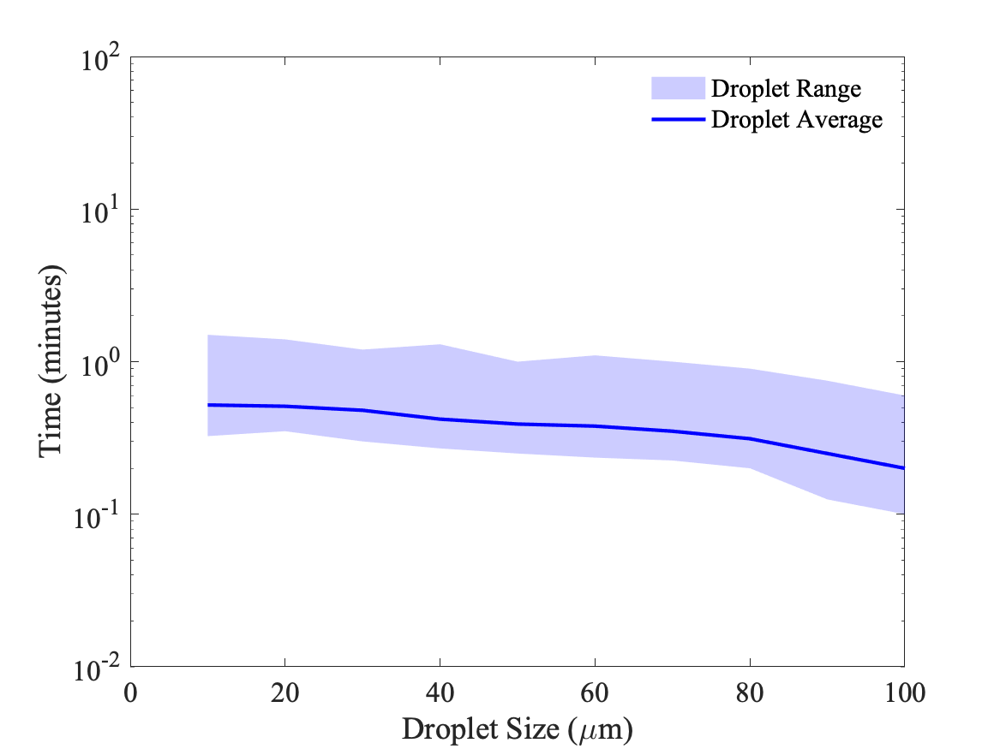

# DropPlotAreaMaker
The purpose of this code is to create area plots with an underlying 'average value' line plot for droplet diagrams (such as droplet size vs. time, or droplet size vs. distance travelled). 

This code is intended to be used in publications where high quality diagrams are necessary. Unfortunately, Matlab and other similar software does not have this functionality, so this code was created.

## Sample Plot
Here is a sample single line plot that can be generated with this script:

## Usage
1. You must first create a matrix in matlab called dropData. The dimensions of the matrix should be *MxN*, where the *M* rows correspond to the number of droplet sizes you are considering, and *N=4*.
2. The columns of the data should be organized as such
 - 1st column = droplet size
 - 2nd column = minimums
 - 3rd column = averages
 - 4th column = maximums
 ` >> dropData = zeros(M,4)`
3. Fill in all the data for rows and columns by double clicking the variable *dropData* in the Workspace, then entering all data.
4. Save the data in a .m file by right clicking on the variable in the Workspace and clicking *Save As*
1. Edit line 17 of the AreaPlotFilleMaker.m file to reflect the name of your data file.
1. Run the code to generate your plot, with average values, minima and maxima, displayed on a single plot.
1. You can change the colors, opacity, and other features on lines 19-25 of the code.

## License
This code falls under the GNU GPL license included in the repository. Please be sure to follow the license guidelines.

## Citations
If using this code for publications, please cite appropriately.

Komperda, J. (2021). DropletAreaPlotMaker v0.1 [Source code]. https://github.com/jonkomperda/DropPlotAreaMaker/. DOI: https://doi.org/10.5281/zenodo.4508530

## Questions or Contact
If you have any questions about the code or it's usage, please contact Jon at jonk@uic.edu.
